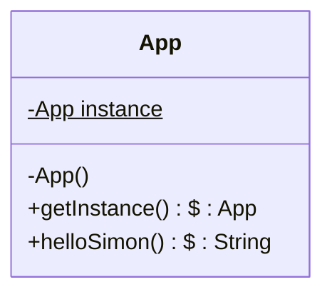
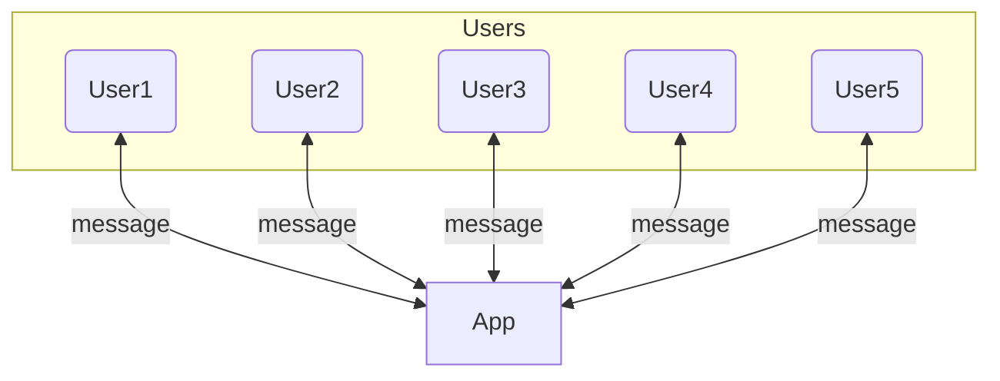
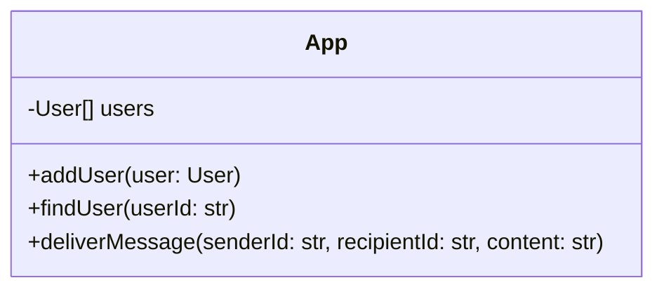
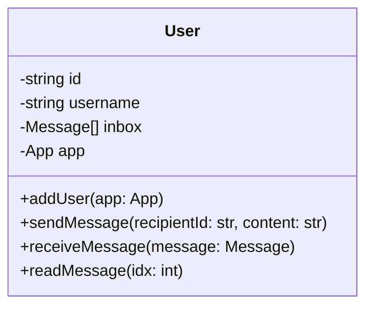
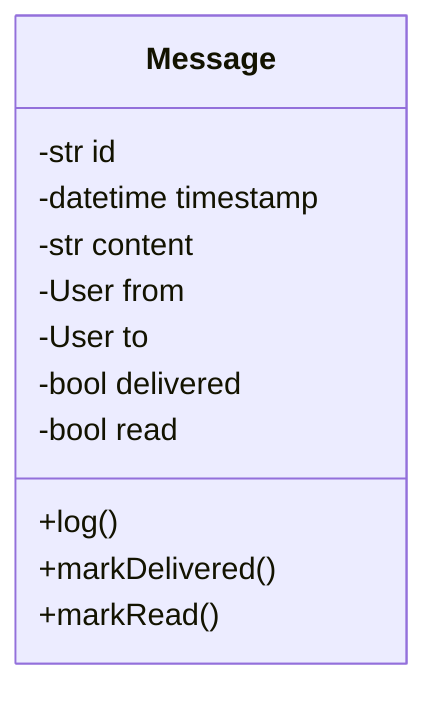
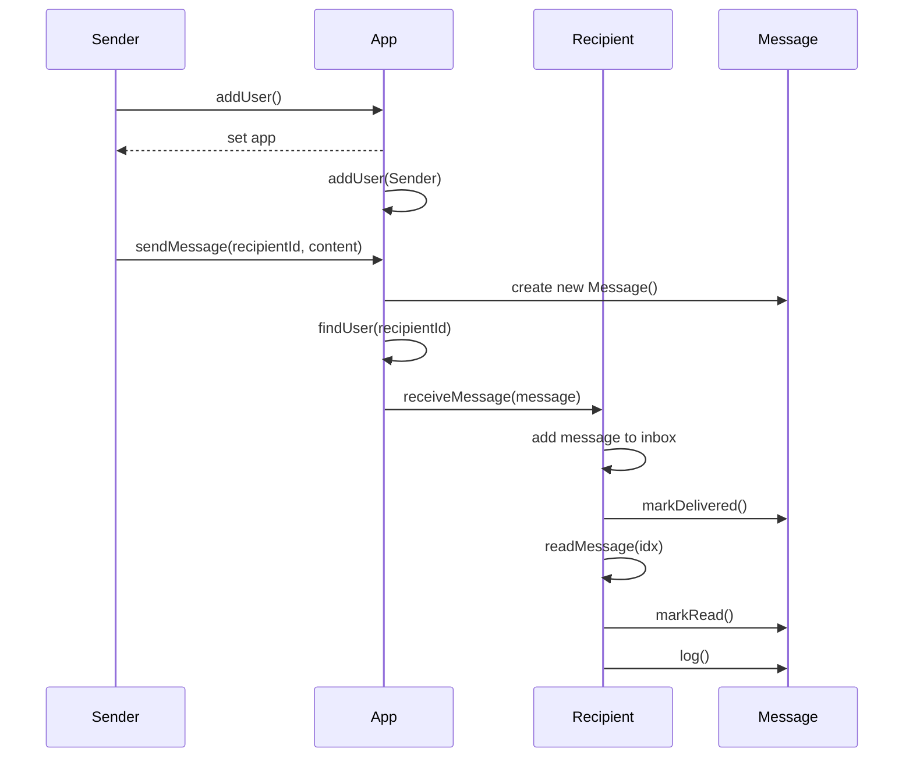

# Requirements

We recommend you make three classes: `App`, `User`, and `Message`.

> **Reading the Class Diagrams:** The class diagrams use UML notation to detail class structure: `+` (Public) and `-` (Private) define access visibility. The dollar sign `$` denotes static members, essential for the Singleton. Finally, the format `name: Type` (e.g., `id: str`, `app: App`) specifies data type or return type.

## Step 1: Implement the Singleton

The first requirement is to implement the **Singleton Pattern** for the `App` class. This ensures only one instance of the central messaging hub can exist.

A class designed to be a Singleton typically has three features, regardless of the programming language:

- A private Constructor to prevent direct, external instantiation (e.g., using new).
- A private Static Instance to hold the single, unique object within the class itself.
- A public Static Access Method `(getInstance())` this is the only way to retrieve the single instance. It handles creation on the first call and returns the existing object on all subsequent calls.

---

## Step 2: Implement the Mediator Pattern

The `App` will now serve as the **Mediator** that coordinates communication between `User` objects.

The new structure enforces that all communication flows through the `App` Mediator:

### App (The Mediator)

The `App` class centralizes all coordination logic.

- `users` is a collection of all users who have logged into the app.
- `addUser()` handles adding a new user to the `users` collection.
- `findUser()` gets the user with the given id from the `users` collection, if possible.
- **`deliverMessage()`**: Uses the given information to **create a new instance of `Message`**, finds the recipient user, and then calls the recipient's `receiveMessage()` method to complete the delivery.

### User

The `User` class initiates actions but delegates communication to the `App` Mediator.

- `id` is a unique string which identifies the user.
- `username` is the user's username.
- `inbox` is a list of messages the user has received.
- `app` is the instance of `App` the user is logged into (set by `addUser`).
- `addUser(app)` adds the user to `app.users` and also sets `user.app` to `app`.
- **`sendMessage()`**: **Delegates the task of message delivery** to the **`App` Mediator** instance it is logged into (`user.app`), passing the recipient's ID and content. **Crucially, the User does not interact with the recipient directly.**
- `receiveMessage()` handles adding an incoming message to the user's `inbox` array.
- `readMessage()` logs the message at the given index in `inbox` to the console, and marks the message as read.

### Message

The `Message` class holds the data and delivery state.

- `id` is a unique id which identifies the message.
- `datetime` is the time at which the message was created.
- `content` is the text content of the message created by the sender.
- `from` is the instance of `User` that sent the message.
- `to` is the instance of `User` that receives the message.
- `delivered` is true once the recipient has received the message.
- `read` is true once the recipient has read the message.
- `log()` prints the message details to the console in a readable format.
- `markDelivered()` sets `delivered` to true.
- `markRead()` sets `read` to true.

---

## Interaction Sequence

This sequence diagram reflects the refactored, decoupled flow where the `App` handles message creation and delivery, and the `Recipient` marks the message as delivered upon receipt.

---

## Testing

It's up to you if you'd like to write and then test, or do TDD, but some things definitely worth testing:

- **Singleton:** Ensure only one instance of `App` can ever be created.
- Users, Messages and App can be created with the correct properties.
- Users can log in to the app.
- User 1 can send a message to User 2 (via the `App`).
- User 2 can read the message.

Feel free to add more\!

---

## Extensions

- **Group messaging**: Add a feature which allows user groups to be created. A user can send a message to the group, and it will be delivered to all recipients in that group.

- **Sent messages**: Create a "sent messages" folder which allows users to keep a copy of all the messages they have sent.

- **Read receipts**: When the recipient reads a message, can you ensure that the message in the "sent messages" of the sender is also updated to `read: true`?

- **Different message protocol**: Let's suppose BeeMail wants to integrate with a different messaging service, and so we have an `ExternalMessage` class which:

  - has `body` instead of `content`
  - has no `timestamp`
  - and the `markRead` method is actually a `toggleRead` method which flips the `read` boolean

  Implement this class, then create an **Adapter class (Adapter Pattern)** which wraps it to make it compatible with the regular `Message` interface.

---
